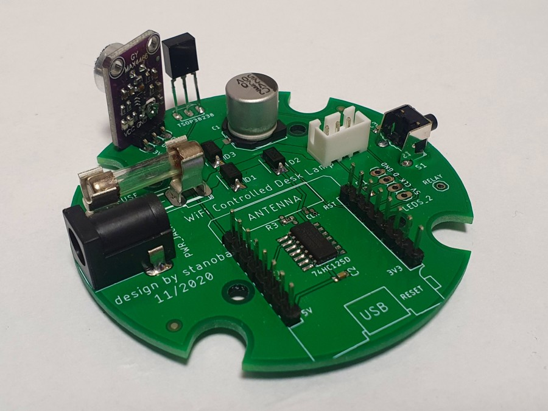
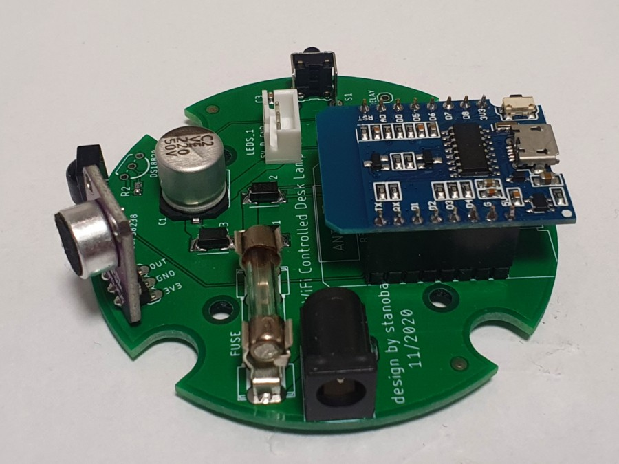
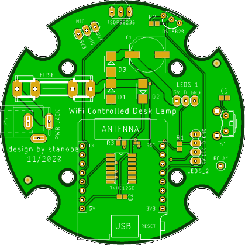
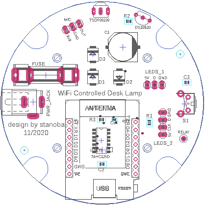

# WiFi Controlled Desk Lamp - Electronic

Electronic is built around **Wemos D1 Mini** which act as brain of the desk lamp. On the PCB we can also find **74HC125D** for 3.3V-5V level-shifting, **MAX4466** as audio input and **TSOP38238** as IR input. Electronic is powered from 5V 2A power adapter and protected by ~1.6A glass fuse (depends on led stripe).

 

---
## Schematic

## PCB

PCB was designed in Eagle 9.6.2:

 

---

## BoM

| **Part** | **Value** | **Package** | **Source** |
| --- | --- | --- | --- |
| C1 | 1500uF | PANASONIC_G | https://www.tme.eu/en/details/eeefp0j152ap/smd-low-imped-electrolytic-capacitors/panasonic/ |
| C2, C3 | 100nF | C0603 | https://www.tme.eu/en/details/vj0603y104kxjcw1bc/0603-mlcc-smd-capacitors/vishay/ |
| R1 | 470 | R0603 | https://www.tme.eu/en/details/smd0603-470r/0603-smd-resistors/royal-ohm/0603saj0471t5e/ |
| R2 | 4k7 | R0603 | https://www.tme.eu/en/details/wf06p-4k7-5%25/0603-smd-resistors/walsin/wf06p472jtl/ |
| R3 | 10k | R0603 | https://www.tme.eu/en/details/wf06p-10k-5%25/0603-smd-resistors/walsin/wf06p103jtl/ |
| D1, D2, D3 | SS24 | SMB | https://www.tme.eu/en/details/ss24-fai/smd-schottky-diodes/on-semiconductor/ss24/ |
| FUSE | 2x clips |  | https://www.tme.eu/en/details/zh3/pcb-fuseholders/ |
| FUSE | 1.6A | 5x20 | https://www.tme.eu/en/details/zks-1.6a/fuses-5x20mm-fast/eska/520-619/ |
| IC1 | 74HC125D | SO14 | https://www.tme.eu/en/details/74hc125d.652/buffers-transceivers-drivers/nexperia/ |
| IC3 | DS18B20 | TO92 | https://www.tme.eu/en/details/ds18b20+/temperature-transducers/maxim-integrated/ |
| S1 | BTN1 | B3F-31XX | https://www.tme.eu/en/details/pts645vl58-2/microswitches-tact/c-k/pts645vl58-2-lfs/ |
| JP1 | 1X01 | pin header |
| LEDS_1 | 1X03 | pin header | https://www.tme.eu/en/details/nx2500-03sms/raster-signal-connectors-2-50mm/joint-tech/a2501wv-3p1/ |
| LEDS_2 | 1X04 | pin header | https://www.tme.eu/en/details/nx2500-04sms/raster-signal-connectors-2-50mm/joint-tech/a2501wv-4p1/ |
| MIC | 1X03 | pin header | https://www.tme.eu/en/details/ds1022-1x4rdf14/pin-headers/connfly/ds1022-1-4rdf14/ |
| PWR_JACK | SPC4077 | con-jack | https://www.tme.eu/en/details/pc-gk2.1/dc-power-connectors/ninigi/ |
| U$1 | WEMOS-D1-MINI | module | https://www.aliexpress.com/item/32651747570.html |
| U$2 | TSOP38238 | TSOP18XX | https://www.tme.eu/en/details/tsop38238/ir-receiver-modules/vishay/ |
| U$3 | MAX4466 | module | https://www.aliexpress.com/item/32607495483.html |

