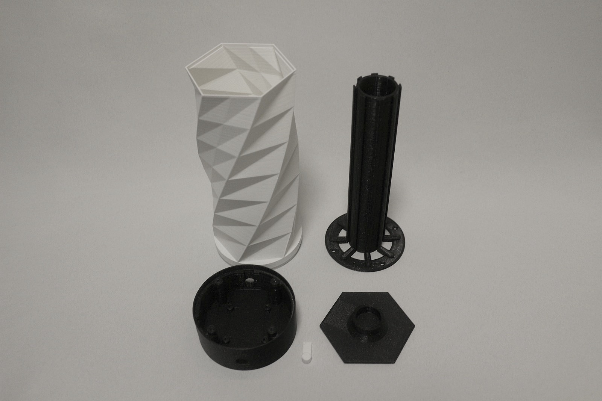
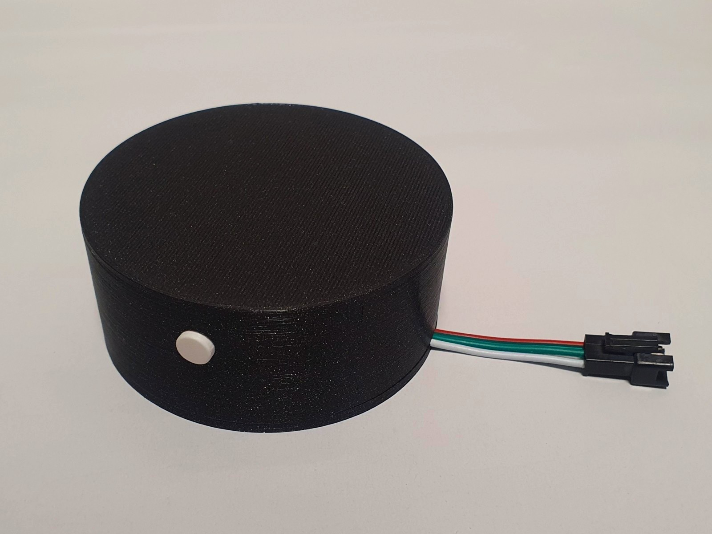
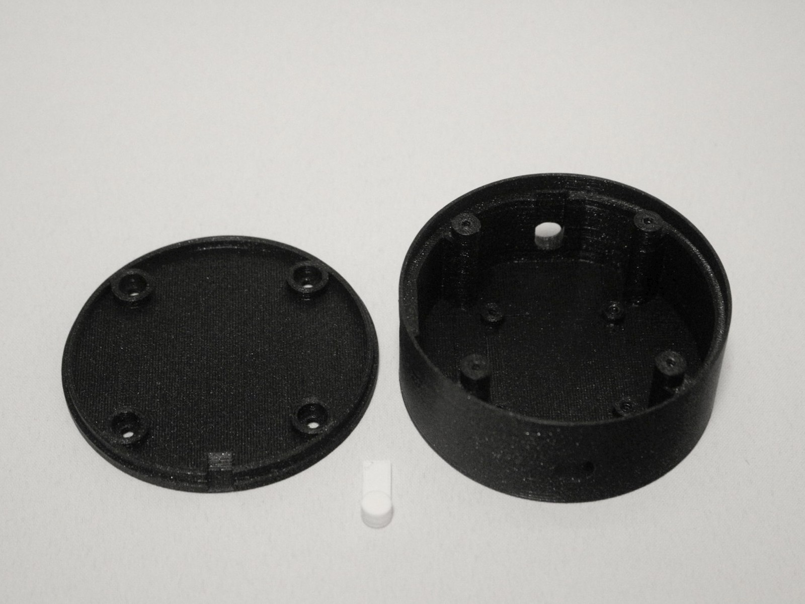

# WiFi Controlled Desk Lamp

**WiFi Controlled Desk Lamp** project was inspired by [Twisted WiFi Controlled Desk Lamp](https://www.thingiverse.com/thing:4129249). 

Desk Lamp includes 80 WS2812B LEDs total split in 8 segments by 10 LEDs.

## Electronic

See <a href="./Hardware">Hardware</a> README.md for more info.

## 3D printed parts

See <a href="./3D models">3D models</a> README.md for more info.

## Build

### PCB in this project could be used in two ways:
---

#### 1. WiFi Controlled Desk Lamp

 

**BoM:**
- 1x WiFi_Controlled_Desk_Lamp_Base.stl
- 1x WiFi_Controlled_Desk_Lamp_Button.stl
- 1x WiFi_Controlled_Desk_Lamp_Core.stl
- 1x WiFi_Controlled_Desk_Lamp_Twisted_Hull.stl
- 1x WiFi_Controlled_Desk_Lamp_Twisted_Top.stl
- 1x Completed PCB
- 1x Wemos D1 mini
- 8x 170 mm LED strip WS2812B (80 LEDs total)
- 1x 5V power adapter
- 4x screws 3 x 5 mm
- 4x screws 3 x 13 mm

---
#### 2. LED stripe WiFi Controller (Puck)

 

**BoM:**
- 1x WiFi_Controlled_Desk_Lamp_Base.stl
- 1x WiFi_Controlled_Desk_Lamp_Button.stl
- 1x WiFi_Controlled_Desk_Lamp_Top_Cover.stl
- 1x Completed PCB
- 1x Wemos D1 mini
- 1x LED strip WS2812B (based on your needs)
- 1x 5V power adapter
- 4x screws 3 x 5 mm
- 4x screws 3 x 13 mm

## Software

**WiFi Controlled Desk Lamp** was designed so it can run on [WLED](https://github.com/Aircoookie/WLED) or [WLED Sound Reactive](https://github.com/atuline/WLED) firmware.

You can also use original software [ESP8266 FastLED IoT Webserver](https://github.com/NimmLor/esp8266-fastled-iot-webserver).

See respective projects github pages for details.
